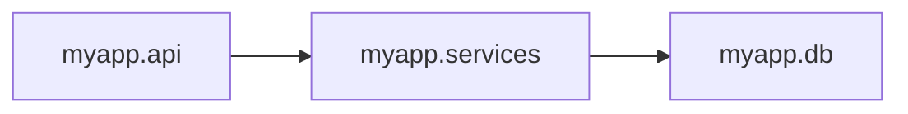

[](https://pypi.org/project/archetype-py/)
[](https://pypi.org/project/archetype-py/)
[](https://github.com/MossabArektout/archetype-py/blob/main/LICENSE)
[](https://github.com/MossabArektout/archetype-py/actions/workflows/ci.yml)

# archetype-py

Enforce architectural rules as code. Catch forbidden imports, layer leaks, cycles, and boundary violations before they merge.

`archetype-py` builds a static import graph for your Python project, runs the rules you define in `architecture.py`, and reports the result in local terminals, CI, JSON output, and pytest.

## Quick Start

Install the package:

```bash
pip install archetype-py
```

Generate a starter architecture file:

```bash
archetype init .
```

Edit `architecture.py`, then run:

```bash
archetype check .
```

For CI, add the same command:

```yaml
- run: archetype check .
```

Requires Python 3.11+.

## Why Archetype

Most Python quality tools check formatting, typing, lint rules, and test behavior. They do not usually protect system structure.

As a codebase grows, architectural drift shows up as:

- API modules importing database internals
- domain code depending on infrastructure
- services forming circular imports
- internal modules being used from the wrong package
- rules living only in team memory and code review comments

Archetype turns those expectations into executable checks.

## Minimal Example

```python
from archetype import group, imports, rule, since, warn
from archetype.rules import no_cycles

with group("Layer boundaries"):
    @rule("api-must-not-import-db")
    def api_must_not_import_db() -> None:
        imports("myapp.api").must_not_import("myapp.db")

@rule("services-should-not-use-db-internals")
@warn
def services_should_not_use_db_internals() -> None:
    imports("myapp.services").must_not_import("myapp.db.internal")

@rule("recent-code-must-not-use-legacy")
@since("2026-01-01")
def recent_code_must_not_use_legacy() -> None:
    imports("myapp.api").must_not_import("myapp.legacy")

@rule("no-import-cycles")
def no_import_cycles() -> None:
    no_cycles("myapp")
```

Run the rules:

```bash
archetype check .
```

Example output:

```text
FAILED
======
  x api-must-not-import-db
    - myapp/api/users.py:7
        imports myapp.db.internal.session

Summary: 0 passed, 1 failed, 0 warned, 0 skipped
```

## Core Features

- Forbidden import rules
- Allowlisted import rules
- Transitive dependency checks
- Layer ordering rules
- Import cycle detection
- Protected internal module boundaries
- Naming convention checks
- Rule groups and targeted execution
- Warning-only rules
- Temporary skips with reasons
- Date-scoped rules with `@since`
- Baseline mode for legacy adoption
- Changed-files mode for CI and large repositories
- GitHub Actions inline PR annotations
- Project diagnostics with `archetype doctor`
- Import graph export with `archetype graph`
- JSON and text report formats
- Project defaults through `archetype.toml`
- Path exclusions from CLI or config
- Import graph caching
- Pytest plugin support
- Git pre-commit hook installer

## Supported Layouts

Archetype detects common Python project layouts:

- flat packages, such as `myapp/`
- single `src/` layouts, such as `src/myapp/`
- namespace packages without `__init__.py`
- monorepos with multiple nested `*/src` roots

Use `archetype doctor .` to inspect what Archetype detected.

## Commands

| Command | Purpose |
|---|---|
| `archetype init [path]` | Generate a starter `architecture.py`. |
| `archetype check [path]` | Load `architecture.py` and run all registered rules. |
| `archetype check [path] --group <name>` | Run only rules in one group. |
| `archetype check [path] --format json` | Emit machine-readable JSON report output. |
| `archetype check [path] --quiet` | Show only failures and warnings. |
| `archetype check [path] --no-cache` | Force a fresh import graph rebuild. |
| `archetype check [path] --exclude <pattern>` | Exclude paths from analysis and reporting. |
| `archetype check [path] --changed-from <ref>` | Report only violations in Python files changed from a Git ref. |
| `archetype check [path] --write-baseline <file>` | Write the current violations to a baseline file. |
| `archetype check [path] --baseline <file>` | Suppress matching baseline violations. |
| `archetype check [path] --github-annotations` | Emit GitHub Actions inline annotation commands. |
| `archetype doctor [path]` | Explain detected project layout, graph, config, cache, and rule context. |
| `archetype graph [path] --format mermaid\|json` | Export the discovered import graph. |
| `archetype install-hook [path]` | Install or update a managed Git pre-commit hook. |

Common check flag examples:

```bash
# Run only rules in one group
archetype check . --group "Layer boundaries"

# Emit machine-readable JSON
archetype check . --format json

# Show only failures and warnings
archetype check . --quiet

# Ignore the import graph cache and rebuild from source
archetype check . --no-cache
```

## Rule Helpers

Rules are plain Python functions registered with decorators.

| Helper | Purpose | Example |
|---|---|---|
| `@rule("name")` | Register a rule with a display name. | `@rule("api-not-db")` |
| `@warn` | Report violations without failing the exit code. | `@warn` |
| `@skip` / `@skip(reason="...")` | Temporarily skip a rule. | `@skip(reason="Refactor in progress")` |
| `@since("YYYY-MM-DD")` | Only report violations in files modified after a date. | `@since("2026-01-01")` |
| `group("name")` | Assign enclosed rules to a group. | `with group("Layer boundaries"):` |

Decorator order tip: write `@rule(...)` as the top decorator, above wrappers such as `@warn`, `@skip`, or `@since`.

```python
@rule("warning-example")
@warn
def warning_example() -> None:
    ...
```

## Diagnostics

Use `doctor` when a rule does not behave as expected:

```bash
archetype doctor .
```

It reports detected layout, package roots, Python module count, import edge count, config source, excludes, cache status, detected layers, internal packages, and whether `architecture.py` exists.

Export the import graph for debugging or documentation:

```bash
archetype graph . --format mermaid
archetype graph . --format json
```

When a source, target, allowed, layer, boundary, cycle, or naming pattern matches no modules, Archetype reports a diagnostic warning with likely suggestions. This helps catch typos and stale rules instead of silently passing them.

## Configuration

Archetype auto-discovers `archetype.toml` from the project root passed to `archetype check [path]`.

```toml
format = "json"
quiet = true
group = "Layer boundaries"
exclude = ["/vendor/", "/migrations/"]
workers = 4
cache = true
```

Supported defaults:

- `format`: `"text"` or `"json"`
- `quiet`: `true` or `false`
- `group`: rule group name
- `exclude`: string or list of strings
- `workers`: integer greater than or equal to `1`
- `cache`: `true` or `false`

Precedence:

1. CLI flags
2. `archetype.toml`
3. built-in defaults

For compatibility, if `archetype.toml` is missing, Archetype still reads legacy `[tool.archetype]` settings from `pyproject.toml`.

## Path Exclusions

Exclude generated code, vendored dependencies, migrations, or other noisy paths:

```bash
archetype check . --exclude /vendor/ --exclude /migrations/
```

Or define the defaults in `archetype.toml`:

```toml
exclude = ["/vendor/", "/migrations/"]
```

## Baseline Mode

Baseline mode lets you adopt Archetype in an existing codebase without failing CI on every old violation.

Create a baseline:

```bash
archetype check . --write-baseline archetype-baseline.json
```

Run against that baseline:

```bash
archetype check . --baseline archetype-baseline.json
```

Matching old violations are suppressed. New blocking violations still fail with exit code `1`.

## Changed-Files Mode

Use diff scope for large projects or pull request checks:

```bash
archetype check . --changed-from origin/main
```

`<ref>` can be a branch name or commit SHA. Text output shows a scope banner, and JSON output includes a `scope` object with the changed file metadata.

## GitHub Actions

Basic CI:

```yaml
name: Architecture

on:
  pull_request:
  push:
    branches: [main]

jobs:
  archetype:
    runs-on: ubuntu-latest
    steps:
      - uses: actions/checkout@v5
      - uses: actions/setup-python@v5
        with:
          python-version: "3.11"
      - run: python -m pip install archetype-py
      - run: archetype check .
```

Inline PR annotations:

```yaml
- run: archetype check . --github-annotations
```

## Pytest

Archetype ships a pytest plugin. With the package installed, pytest can collect rules from `architecture.py` and report them as test items.

```bash
pytest
```

This is useful when architecture rules should live beside the rest of the test suite.

## JSON Report Contract

`archetype check --format json` emits a versioned report contract.

Current report schema:

```text
schema_version: 2
```

Top-level fields:

- `schema_version`: report contract version
- `summary`: counts for passed, failed, warned, skipped, and total rules
- `violations`: total, new, and baseline-suppressed violation counts
- `rules`: per-rule results
- `scope`: optional changed-files metadata when `--changed-from` is used

Each rule includes:

- `name`
- `status`
- `group`
- `since_date`
- `violations`
- `diagnostics`

Each violation includes:

- `module`
- `file`
- `line`
- `target`
- `message`

Example:

```json
{
  "schema_version": 2,
  "summary": {
    "passed": 2,
    "failed": 1,
    "warned": 0,
    "skipped": 0,
    "total": 3
  },
  "violations": {
    "total": 1,
    "new": 1,
    "suppressed": 0
  },
  "rules": [
    {
      "name": "api-must-not-import-db",
      "status": "failed",
      "group": "Layer boundaries",
      "since_date": null,
      "violations": [
        {
          "module": "myapp.api.users",
          "file": "myapp/api/users.py",
          "line": 7,
          "target": "myapp.db.internal.session",
          "message": "Module 'myapp.api.users' must not import 'myapp.db' (found import to 'myapp.db.internal.session')."
        }
      ],
      "diagnostics": []
    }
  ]
}
```

Non-breaking additions keep the same schema version. Breaking shape changes increment `schema_version`.

Note: `archetype graph --format json` has its own graph export schema.

## Import Graph Export

Mermaid output is useful for docs:

```bash
archetype graph . --format mermaid
```



JSON output is useful for integrations:

```bash
archetype graph . --format json
```

The graph export includes `nodes` and `edges`; each edge includes `source`, `target`, `file`, and `line`.

## Architecture Visual

<p align="center">
  
</p>

Additional diagrams are available in [`assets/`](./assets).

## Exit Codes

- `0`: no blocking failures
- `1`: one or more blocking failures

Warning-only rules do not fail the process. When `--baseline` is used, exit code `1` means there are new blocking violations not present in the baseline.

## Development

Install development dependencies:

```bash
pip install -e ".[dev]"
```

Run tests:

```bash
pytest
```

Run Archetype against itself:

```bash
archetype check .
```

Build the package:

```bash
hatch build
```

## Troubleshooting

`Error: architecture.py not found`

Run `archetype init .` in your project root, or pass the correct path to `archetype check <path>`.

Rules seem to do nothing

Confirm the functions are decorated with `@rule("...")`. Undecorated functions are not registered.

Pattern matches no modules

Run `archetype doctor .`, then check that your patterns use fully qualified module names such as `myapp.api`, not file paths such as `src/api.py`.

`@since(...)` behaves unexpectedly

Use `YYYY-MM-DD` format and make sure Git history is available in the checked path.

Imports are missing from the graph

Check that modules live under detected package roots. `archetype doctor .` shows the roots Archetype is using.

## Roadmap

See [`ROADMAP.md`](./ROADMAP.md) for planned work.

## Contributing

Contributions are welcome: bug fixes, rule ideas, documentation improvements, integrations, and performance work.

See [`CONTRIBUTING.md`](./CONTRIBUTING.md).

## License

MIT. See [`LICENSE`](./LICENSE).
